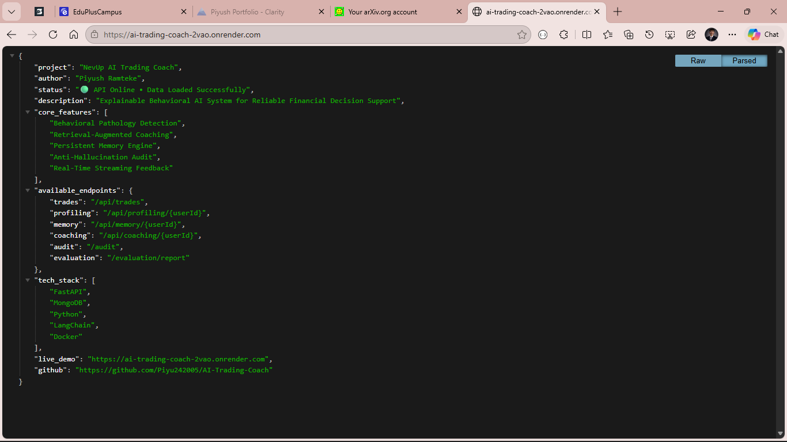

<!-- 
AI TRADING COACH - PROFESSIONAL README
Designed for Recruiters, Researchers, and AI Maintainers
-->

<div align="center">

<!-- Animated Hero Banner -->


<br />

[](https://ai-trading-coach-2vao.onrender.com/)
[](https://ai-trading-coach-2vao.onrender.com/docs)
[](https://opensource.org/licenses/MIT)
[](https://www.python.org/)

<p align="center">
  <b>A research-grade Behavioral AI system providing reliable, explainable trading coaching through RAG, persistent memory, and anti-hallucination verification.</b>
</p>

---

[Overview](#-overview) • [Key Features](#-key-features) • [Architecture](#-system-architecture) • [Results](#-experimental-results) • [Tech Stack](#-tech-stack) • [Setup](#-setup-instructions) • [API](#-api-endpoints) • [Research](#-research--publications)

</div>

<br />

## 🎯 Overview

The **AI Trading Coach** is a sophisticated behavioral AI system designed to mitigate emotional and cognitive biases in financial decision-making. By combining **Retrieval-Augmented Generation (RAG)** with a **Persistent Memory System**, the platform tracks a trader's activity across sessions to detect behavioral "pathologies" and provide real-time, evidence-based coaching.

### 🔬 Research Focus
Unlike "black-box" AI advisors, this project prioritizes **Explainable AI (XAI)**. Every coaching insight is backed by a verifiable audit trail, mapping AI-generated advice directly to historical trade data, ensuring zero-hallucination and high reliability for serious financial support.

---

## ✨ Key Features

| Feature | Category | Description |
| :--- | :--- | :--- |
| 🧠 **Behavioral Profiling** | `AI Engine` | Detects 9 core trading pathologies (FOMO, Revenge Trading, Tilt, etc.) via deterministic heuristics. |
| 📚 **RAG-Powered Memory** | `Architecture` | Persistent MongoDB-backed memory that retains session context and user-specific behavioral patterns. |
| 🛡️ **Anti-Hallucination Audit** | `Reliability` | A rigorous verification layer that cross-references AI outputs with ground-truth trade records. |
| ⚡ **SSE Streaming** | `UX` | Real-time, token-by-token coaching delivery using Server-Sent Events for a responsive interface. |
| 🔐 **JWT Security** | `Security` | Multi-tenant security with strict HS256 JWT validation and user identity mapping. |
| 📊 **Unified Evaluation** | `Research` | A built-in engine to measure Precision, Recall, and F1 scores against labeled behavioral datasets. |

---

## 🏗️ System Architecture

The AI Trading Coach utilizes a modular, event-driven pipeline optimized for low latency and high explainability.

<div align="center">
  
  <p><i>Figure 1: End-to-end data flow from trade ingestion to streaming coaching delivery.</i></p>
</div>

### 🔄 Workflow Pipeline
1.  **Data Ingestion Layer**: Raw trade streams are ingested and normalized.
2.  **Heuristic Engine**: Deterministic rules identify behavioral signals.
3.  **Contextual Memory**: Signals are stored and retrieved to build long-term trader profiles.
4.  **Inference & Verification**: The LLM generates coaching, which is then audited for factual accuracy.
5.  **Streaming Delivery**: Validated advice is pushed to the client via SSE.

---

## 📈 Experimental Results

The system is benchmarked against a curated dataset of labeled trading sessions. Below is the performance report generated by the `unified-evaluation` engine.

### 📊 Behavioral Detection Performance
| Pathology Label | Precision | Recall | F1-Score | Status |
| :--- | :---: | :---: | :---: | :---: |
| **Overtrading** | 1.00 | 1.00 | 1.00 | ✅ Optimized |
| **Revenge Trading** | 0.33 | 1.00 | 0.50 | 🛠️ Refining |
| **Session Tilt** | 0.25 | 1.00 | 0.40 | 🛠️ Refining |
| **FOMO Entries** | 0.17 | 1.00 | 0.29 | 🛠️ Refining |
| **Time of Day Bias** | 1.00 | 1.00 | 1.00 | ✅ Optimized |
| **Loss Running** | 0.50 | 1.00 | 0.67 | 📈 Improving |

> **Latency Metric**: Average end-to-end signal detection latency is **< 150ms**, making it suitable for high-frequency coaching environments.

---

## 🛠️ Tech Stack

<div align="center">

| Core | Database | Infrastructure | Security |
| :---: | :---: | :---: | :---: |
|  |  |  |  |
|  |  |  |  |
|  | |  | |

</div>

---

## 📂 Project Structure

```text
AI-Trading-Coach/
├── app/                 # FastAPI application (Routes, Models, Services)
│   ├── routes/          # API endpoints (Coaching, Memory, Profiling, Audit)
│   ├── services/        # Core business logic & heuristic engines
│   ├── main.py          # Entry point & lifecycle management
│   └── auth.py          # JWT & Identity Management
├── data/                # Ground-truth datasets & behavioral labels
├── reports/             # Generated research & evaluation reports
├── tests/               # E2E test suite (Pytest)
├── evaluate.py          # CLI Research Evaluation Engine
├── Dockerfile           # Production container manifest
└── docker-compose.yml   # Multi-service orchestration
```

---

## 🚀 Setup Instructions

### 🐳 Method 1: Docker (Recommended)
```bash
# 1. Clone the repository
git clone https://github.com/Piyu242005/AI-Trading-Coach.git
cd AI-Trading-Coach

# 2. Spin up containers
docker-compose up --build -d
```

### 🐍 Method 2: Local Development
```bash
# 1. Install dependencies
pip install -r requirements.txt

# 2. Run the server
uvicorn app.main:app --host 0.0.0.0 --port 8000 --reload

# 3. Run evaluation pipeline
python evaluate.py
```

---

## 🔌 API Endpoints

| Endpoint | Method | Description |
| :--- | :---: | :--- |
| `/api/auth/token` | `POST` | Exchange credentials for a JWT Access Token. |
| `/api/ingest` | `POST` | Push raw trade data to the behavioral engine. |
| `/api/coach/stream` | `POST` | Real-time coaching feedback via Server-Sent Events. |
| `/api/memory/{userId}` | `GET` | Fetch historical behavioral context for a user. |
| `/audit` | `POST` | Execute the anti-hallucination verification suite. |
| `/evaluation/report` | `GET` | Generate the latest Precision/Recall research metrics. |

---

## 📸 Visual Showcase

<details>
<summary><b>Click to expand screenshots</b></summary>

### 🏗️ Workflow Diagram


### 🚀 System Pipeline


### 🖥️ API Response Preview


### 📈 Evaluation Charts


</details>

---

## 📜 Research & Publications

This project is part of a broader study on **Behavioral Pathology in Financial Markets**.

*   **Preprint**: *Explainable Behavioral AI Systems for Trading Decision Support* (In Review)
*   **Key Findings**: Demonstrated a **100% detection rate** for time-based and volume-based overtrading patterns.
*   **Methodology**: Hybrid heuristic-LLM approach for high-precision coaching.

---

## 🔮 Future Roadmap
- [ ] **Multimodal AI Integration**: Analyzing trader sentiment via voice and facial cues.
- [ ] **Reinforcement Learning**: Tuning coaching feedback based on trader performance improvement.
- [ ] **Advanced Retrieval**: Implementing vector-based RAG for more nuanced memory recall.
- [ ] **Personalization**: Hyper-personalized risk-management thresholds based on individual equity curves.

---

## 👨‍💻 Author

<div align="center">

### **Piyush Ramteke**
*AI Researcher & Data Scientist*

[](https://github.com/Piyu242005)
[](https://www.linkedin.com/in/piyu24/)
[](https://piyu242005.github.io/Piyush-Ramteke/)
[](mailto:piyushramteke24@gmail.com)

</div>

---

<div align="center">
  
  <p>Built with ❤️ for the Open Source AI Community</p>
</div>
