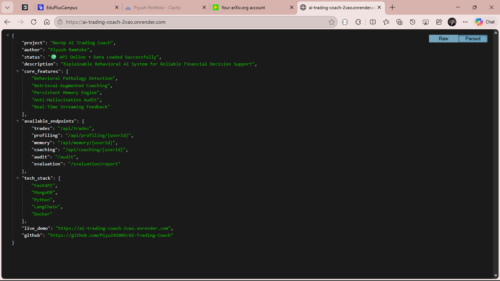
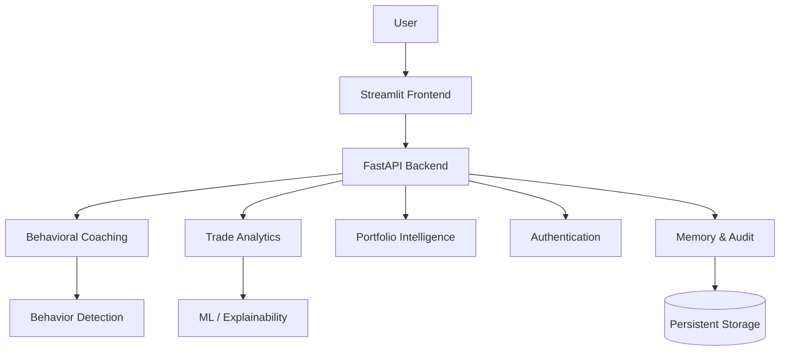

<div align="center">

# AI Trading Coach

**AI-Powered Trading Intelligence, Behavioral Analytics & Portfolio Optimization Platform**

[](https://www.python.org)
[](https://fastapi.tiangolo.com/)
[](https://streamlit.io/)
[](https://xgboost.readthedocs.io/)
[](https://shap.readthedocs.io/)
[](https://plotly.com/)
[](https://www.postgresql.org/)
[](https://www.docker.com/)
[](https://github.com/features/actions)

</div>

## Overview

AI Trading Coach helps traders improve decision-making through behavioral analytics, explainable machine learning, portfolio analysis, trading-journal insights, and conversational coaching.

> **Important:** This project is a decision-support and education tool. It does not provide guaranteed returns or personalized financial advice.

## Core Features

### AI Trading Coach
- Conversational trading assistant
- Trading education and market explanations
- Portfolio guidance
- AI-generated coaching recommendations

### Behavioral Intelligence
- Discipline Score
- Patience Score
- Risk Control Analysis
- Emotional Trading Detection
- Consistency Tracking
- FOMO, revenge trading, tilt, overtrading and plan-deviation detection

### Trade Analysis & Explainability
- Trade success prediction pipeline
- Risk and confidence metrics
- SHAP-based feature explanations where the ML pipeline is enabled
- Human-readable reasoning

### Portfolio Intelligence
- Portfolio Health Score
- Asset Allocation Analysis
- Performance Tracking
- Diversification Analysis
- Risk Monitoring

### Trading Journal
- Trade Logging
- Strategy Evaluation
- Performance Review
- Learning Notes

### Backend Platform
- FastAPI REST APIs
- JWT authentication
- Persistent session memory
- Audit and evaluation endpoints
- Server-Sent Events for streaming coaching
- MongoDB/SQLite-compatible project components

## Demo & Preview

Live deployment: https://ai-trading-coach-2vao.onrender.com



## Architecture


```mermaid
graph TD
    A[User] --> B[Streamlit Frontend]
    B --> C[FastAPI Backend]
    C --> D[Behavioral Coaching]
    C --> E[Trade Analytics]
    C --> F[Portfolio Intelligence]
    C --> G[Authentication]
    C --> H[Memory & Audit]
    D --> I[Behavior Detection]
    E --> J[ML / Explainability]
    H --> K[(Persistent Storage)]
```

## Behavioral Detection Pipeline

Trade History → Validation → Session Grouping → Behavioral Signal Detection → Priority Ranking → Coaching Response → Evaluation

The coaching service currently detects patterns including revenge trading, session tilt, overtrading, FOMO entries, plan non-adherence, premature exits, loss running, time-of-day bias, and position-sizing inconsistency.

## Evaluation

The API exposes a reproducible evaluation endpoint:

```text
GET /evaluation/report
GET /evaluation/report?format=html
```

It reports overall and per-label **precision, recall, and F1**, comparing detected behavioral labels with the project's ground-truth dataset. Treat these as benchmark results for the included dataset, not as evidence of live-market predictive performance.

## Tech Stack

**Frontend:** Streamlit, Plotly  
**Backend:** FastAPI, Python  
**ML/XAI:** XGBoost, Scikit-Learn, SHAP, Pandas, NumPy  
**Data:** MongoDB / SQLite-compatible components  
**DevOps:** Docker, GitHub Actions  

## Project Structure

```text
AI-Trading-Coach/
├── .github/workflows/       # CI/CD
├── app/                     # FastAPI backend
│   ├── routes/              # API endpoints
│   ├── services/            # Behavioral and coaching logic
│   ├── main.py              # API entrypoint
│   ├── auth.py              # JWT authentication
│   └── database.py          # Dataset/database connectors
├── data/                    # Seed datasets
├── frontend-streamlit/      # Streamlit frontend and ML components
├── tests/                   # PyTest suite
├── Research_Submission/     # Research documents and figures
├── assets/                  # README/demo assets
├── Dockerfile
├── Procfile
├── requirements.txt
└── Readme.md
```

## Installation

### 1. Clone

```bash
git clone https://github.com/Piyu242005/AI-Trading-Coach.git
cd AI-Trading-Coach
```

### 2. Configure environment

Set a strong secret before starting the API:

```bash
export JWT_SECRET="replace-with-a-long-random-secret"
export JWT_ALGORITHM="HS256"
export JWT_EXPIRES_MINUTES="60"
export ALLOWED_ORIGINS="http://localhost:3000,http://localhost:8501"
```

On Windows PowerShell, use `$env:JWT_SECRET = "..."` instead.

### 3. Frontend setup

```bash
cd frontend-streamlit
python -m venv venv
source venv/bin/activate
pip install -r requirements.txt
streamlit run app.py
```

### 4. Backend setup

From the repository root:

```bash
pip install -r requirements.txt
uvicorn app.main:app --reload
```

Docker is also supported:

```bash
docker-compose up --build
```

## CI/CD

GitHub Actions runs dependency installation, Ruff linting/format checks, and the PyTest suite. Lint or test failures intentionally fail the workflow so regressions cannot silently pass CI.

## Security Configuration

- `JWT_SECRET` is mandatory and has no hard-coded production fallback.
- API CORS origins are controlled through `ALLOWED_ORIGINS`.
- `.env` files and Python cache artifacts are excluded through `.gitignore`.
- Never commit production secrets, API keys, database credentials, or private tokens.

## Roadmap

- RAG-powered trading knowledge base
- Multi-agent trading assistant
- Market/news sentiment analysis
- Reinforcement-learning strategy research
- Real-time market data feeds
- Advanced portfolio risk optimization

## Research

The `Research_Submission/` directory contains the project's design brief, research paper, experimental results, and supporting figures.

## Resume Highlights

- Architected an AI-powered behavioral trading platform using FastAPI and Streamlit.
- Engineered behavioral signal detection for emotional and discipline-related trading patterns.
- Implemented JWT-protected APIs, persistent memory, audit workflows, and streaming coaching responses.
- Built an evaluation pipeline reporting precision, recall, and F1 against project ground truth.
- Added Docker and GitHub Actions CI for reproducible deployment and regression testing.
