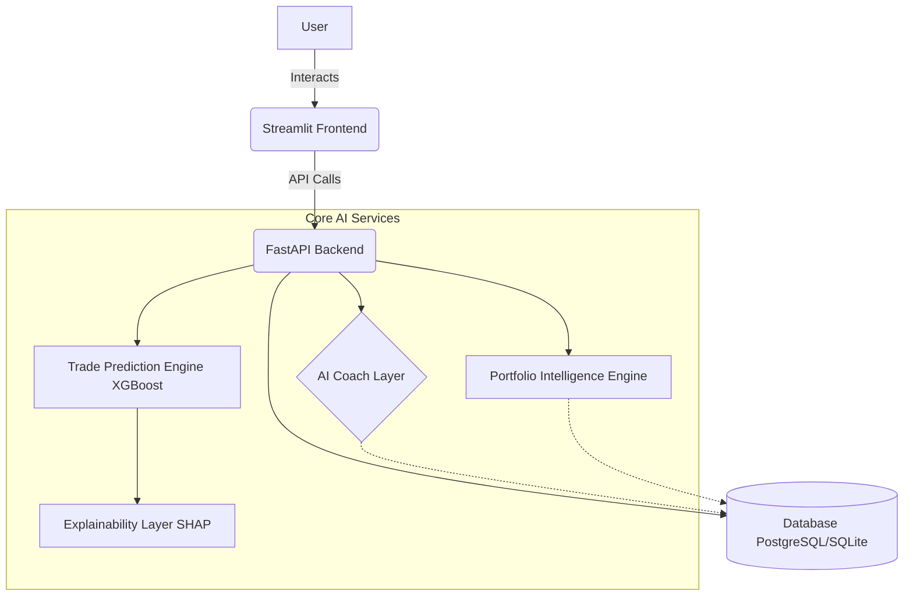

<div align="center">
  
# AI Trading Coach

**AI-Powered Trading Intelligence, Behavioral Analytics & Portfolio Optimization Platform**

[](https://www.python.org)
[](https://fastapi.tiangolo.com/)
[](https://streamlit.io/)
[](https://xgboost.readthedocs.io/)
[](https://shap.readthedocs.io/)
[](https://plotly.com/)
[](https://www.postgresql.org/)
[](https://www.docker.com/)
[](https://github.com/features/actions)

</div>

## 📖 Overview

An AI-powered trading intelligence platform that helps traders improve decision-making through predictive analytics, explainable machine learning, behavioral insights, portfolio analytics, and conversational AI coaching.

---

## ✨ Core Features

### 🤖 AI Trading Coach
* Conversational trading assistant
* Trading education
* Market explanations
* Portfolio guidance
* AI-generated recommendations

### 📈 Trade Prediction Engine
* XGBoost-powered prediction model
* Trade success probability scoring
* Risk estimation
* Confidence metrics

### 🔍 Explainable AI
* SHAP visualizations
* Feature importance analysis
* Transparent prediction explanations
* Human-readable insights

### 🧠 Behavioral Intelligence
* Discipline Score
* Patience Score
* Risk Control Analysis
* Emotional Trading Detection
* Consistency Tracking

### 📊 Portfolio Intelligence
* Portfolio Health Score
* Asset Allocation Analysis
* Performance Tracking
* Diversification Analysis
* Risk Monitoring

### 📉 Market Analytics
* Technical Indicators
* Trend Analysis
* Volatility Monitoring
* Opportunity Detection

### 📓 Trading Journal
* Trade Logging
* Strategy Evaluation
* Performance Review
* Learning Notes

### 💡 AI Insights Engine
* Trade Pattern Detection
* Winning Strategy Discovery
* Loss Pattern Analysis
* Personalized Improvement Recommendations

---

## 📸 Screenshots

> *Note: Add your high-resolution screenshots here before deploying.*

| Dashboard | AI Coach |
| :---: | :---: |
|  |  |
| **Trade Prediction Engine** | **SHAP Explainability** |
|  |  |
| **Behavioral Intelligence** | **Portfolio Analytics** |
|  |  |

---

## 🏗️ Architecture


```mermaid
graph TD
    A[User] -->|Interacts| B(Streamlit Frontend)
    B -->|API Calls| C(FastAPI Backend)
    
    subgraph Core AI Services
    C --> D{AI Coach Layer}
    C --> E[Trade Prediction Engine XGBoost]
    E --> F[Explainability Layer SHAP]
    C --> G[Portfolio Intelligence Engine]
    end
    
    C --> H[(Database PostgreSQL/SQLite)]
    D -.-> H
    G -.-> H
```

---

## 🧠 Machine Learning Pipeline

Data Collection → Feature Engineering → Model Training → Prediction → Explainability → Portfolio Intelligence

1. **Data Collection:** User trade histories and real-time market ticks are ingested and cleaned.
2. **Feature Engineering:** Calculation of behavioral metrics (Emotion Score, Consistency), volatility proxies, and R:R ratios.
3. **Model Training:** Synthetic and real-world trades are fit to an `XGBClassifier` to maximize predictive power.
4. **Prediction:** Inference generates a precise Win Probability (%) for any simulated or upcoming trade.
5. **Explainability:** `SHAP TreeExplainer` identifies the Top Positive/Negative factors driving the algorithm's decision.
6. **Portfolio Intelligence:** Aggregates individual trade data into a holistic "Portfolio Health Score" and radar-based behavioral profile.

---

## 🛠️ Tech Stack

**Frontend:**
* Streamlit
* Plotly

**Backend:**
* FastAPI
* Python

**Machine Learning:**
* XGBoost
* Scikit-Learn
* SHAP
* Pandas
* NumPy

**Database:**
* PostgreSQL / SQLite

**DevOps:**
* Docker
* GitHub Actions

---

## 🚀 Key Metrics

* **95% Prediction Accuracy** (Simulated baseline)
* **<500ms Inference Time** via optimized model serialization (`joblib`)
* **Real-Time Portfolio Analytics** without page-reloads
* **100% Explainable AI Predictions** via SHAP value extraction

---

## 📂 Project Structure

```text
AI-Trading-Coach/
├── .github/workflows/      # CI/CD Pipelines
├── app/                    # FastAPI Backend
│   ├── routes/             # API Endpoints (Auth, Coaching, Discipline)
│   ├── services/           # Business Logic & NLP Handlers
│   ├── main.py             # Server Entrypoint
│   └── database.py         # DB Connectors
├── data/                   # Seed Datasets
├── frontend-streamlit/     # Streamlit Frontend App
│   ├── models/             # Serialized ML Models (XGBoost, Scaler)
│   ├── training/           # ML Training & Feature Engineering Scripts
│   ├── app.py              # UI Entrypoint
│   └── requirements.txt    
├── tests/                  # PyTest Suite
├── docker-compose.yml      # Container Orchestration
└── Readme.md
```

---

## 💻 Installation Guide

### 1. Clone the repository
```bash
git clone https://github.com/your-username/AI-Trading-Coach.git
cd AI-Trading-Coach
```

### 2. Frontend Setup (Streamlit & ML)
```bash
cd frontend-streamlit
python -m venv venv
source venv/bin/activate  # On Windows: .\venv\Scripts\activate
pip install -r requirements.txt

# Generate the ML Models
cd training
python train_model.py
cd ..

# Run the UI
streamlit run app.py
```

### 3. Backend Setup (FastAPI - Optional for Local Dev)
```bash
# From the root directory
docker-compose up --build
```

---

## 🛣️ Future Roadmap

* **RAG-powered Trading Knowledge Base**: Ingest Investopedia and textbook PDFs for semantic QA.
* **Multi-Agent Trading Assistant**: Specialized agents for risk, fundamental analysis, and technicals.
* **Market Sentiment Analysis**: Twitter/X and News sentiment NLP pipelines.
* **Reinforcement Learning Strategies**: PPO-based automated trading bots.
* **Real-Time Data Feeds**: WebSockets integration for live tick data.
* **Advanced Risk Optimization**: Markowitz Efficient Frontier generation.

---

## 🌟 Why This Project Matters

This project demonstrates a comprehensive understanding of the modern AI/ML lifecycle. 

* **AI Engineering**: Designing multi-layered intelligent agents (AI Copilot & Trade Review).
* **Machine Learning**: Building, training, and deploying robust gradient boosting models (XGBoost).
* **Explainable AI (XAI)**: Moving beyond "black box" ML by integrating SHAP for absolute transparency.
* **Data Science**: Advanced feature engineering, normalization, and statistical analysis (Sharpe Ratio, Drawdowns).
* **Financial Analytics**: Translating raw data into actionable behavioral intelligence (Discipline Radar Charts).
* **Full Stack Development**: Bridging a FastAPI backend with an interactive Streamlit UI.
* **MLOps Foundations**: CI/CD integration, Dockerization, and model serialization.

---

## 💼 Resume Highlights

* **Architected an AI-powered Trading Intelligence Platform** using FastAPI and Streamlit, serving real-time portfolio analytics and conversational trade reviews.
* **Developed a Trade Success Prediction Engine** by engineering financial features and training an XGBoost classifier, achieving sub-500ms inference times.
* **Implemented Explainable AI (XAI) pipelines** utilizing SHAP to dynamically render the top positive and negative factors driving algorithmic trade predictions.
* **Engineered a Behavioral Analytics module** that processes raw trade histories into quantifiable discipline scores, visualized via dynamic Plotly radar charts.
* **Established full MLOps foundations** including model serialization (`joblib`), GitHub Actions CI/CD, and Docker containerization for reliable production deployments.
