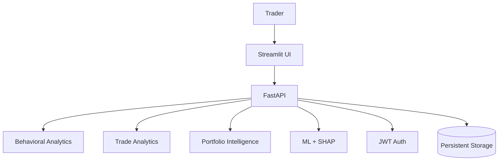

# 📈 AI Trading Coach

### AI-Powered Trading Intelligence, Behavioral Analytics & Portfolio Decision-Support Platform

AI Trading Coach helps traders analyze **trading behavior, portfolio risk, trade quality, and decision patterns** using machine learning, explainability, and conversational coaching.

> **Purpose:** I created this project to combine Data Science, explainable ML, behavioral analytics, and AI coaching into one practical trading decision-support system.

> ⚠️ **Disclaimer:** This is an educational/decision-support project. It does not guarantee returns and is not personalized financial advice.

## ✨ What It Does

| Module | Purpose |
|---|---|
| 🤖 AI Coach | Provides educational trading explanations and coaching |
| 🧠 Behavioral Analytics | Detects FOMO, revenge trading, tilt, overtrading and plan deviation |
| 📊 Trade Analysis | Evaluates trades and provides ML/XAI insights |
| 💼 Portfolio Intelligence | Reviews allocation, diversification and risk |
| 📔 Trading Journal | Records trades and supports performance review |
| 🔐 Secure API | FastAPI + JWT authentication and audit endpoints |
| ⚡ Streaming | Server-Sent Events for coaching responses |

## 🏗️ Architecture


```mermaid
graph TD
    U[Trader] --> S[Streamlit UI]
    S --> A[FastAPI]
    A --> B[Behavioral Analytics]
    A --> T[Trade Analytics]
    A --> P[Portfolio Intelligence]
    A --> M[ML + SHAP]
    A --> AU[JWT Auth]
    A --> DB[(Persistent Storage)]
```

## 🔬 Evaluation

The project provides reproducible behavioral evaluation through:

```text
GET /evaluation/report
GET /evaluation/report?format=html
```

Metrics include **precision, recall and F1** against the project's ground-truth dataset. These are benchmark results for the included data, **not evidence of live-market predictive performance**.

## 🛠️ Stack

**Python · FastAPI · Streamlit · XGBoost · Scikit-learn · SHAP · Pandas · NumPy · Plotly · Docker · GitHub Actions**

## 🚀 Run Locally

```bash
git clone https://github.com/Piyu242005/AI-Trading-Coach.git
cd AI-Trading-Coach
pip install -r requirements.txt
uvicorn app.main:app --reload
```

Frontend:

```bash
cd frontend-streamlit
pip install -r requirements.txt
streamlit run app.py
```

Required configuration includes `JWT_SECRET`, `JWT_ALGORITHM`, `JWT_EXPIRES_MINUTES`, and `ALLOWED_ORIGINS`.

## 🐳 Docker

```bash
docker-compose up --build
```

## 🧪 Quality

CI runs dependency installation, Ruff checks and the PyTest suite. Secrets must be supplied through environment variables and never committed.

## 📂 Structure

```text
app/                    # FastAPI backend
frontend-streamlit/     # Streamlit frontend
 data/                  # Seed datasets
tests/                  # Automated tests
Research_Submission/    # Research material
assets/                 # Demo assets
Dockerfile
requirements.txt
Readme.md
```

## 🗺️ Roadmap

- [ ] RAG trading knowledge base
- [ ] Multi-agent coaching
- [ ] Market/news sentiment
- [ ] Real-time market data
- [ ] Advanced portfolio risk optimization
- [ ] More rigorous walk-forward/time-series evaluation

## 👨‍💻 Author

**Piyush Ramteke** — Data Scientist | AI Engineer | Python Developer

GitHub: https://github.com/Piyu242005
