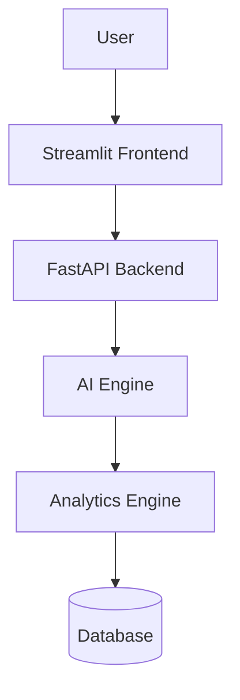

<div align="center">

<!-- Animated Hero Banner -->


<br />

[](https://ai-trading-coach-2vao.onrender.com/)
[](https://ai-trading-coach-2vao.onrender.com/docs)
[](https://opensource.org/licenses/MIT)
[](https://www.python.org/)
[](https://react.dev/)

<p align="center">
  <b>A production-grade SaaS platform providing reliable, explainable trading coaching through RAG, persistent memory, and a ChatGPT-style conversational interface.</b>
</p>

</div>

<br />

# AI Trading Coach
AI-Powered Trading Intelligence, Portfolio Analytics & Financial Decision Support System

[](https://www.python.org/)
[](https://fastapi.tiangolo.com/)
[](https://streamlit.io/)
[](#)
[](https://openai.com/)
[](https://www.postgresql.org/)
[](https://www.docker.com/)
[](https://github.com/features/actions)

## Overview
AI Trading Coach is a production-grade Trading Intelligence Platform that combines behavioral AI, portfolio analytics, and market intelligence to improve financial decision making. It delivers personalized coaching, risk-aware insights, and portfolio diagnostics through a clean Streamlit experience backed by a FastAPI service.

Core platform pillars:
- AI Coaching that explains decisions in plain language
- Portfolio Analytics with risk, performance, and allocation views
- Market Intelligence for trends, volatility, and opportunity detection
- Trading Journal Analytics to improve repeatable strategy execution
- Personalized Financial Insights grounded in user trading history

## Key Features
### AI Trading Coach
- Conversational AI assistant for trade questions and guidance
- Market explanations and context-aware coaching
- Portfolio-aware recommendations and risk feedback

### Portfolio Intelligence
- Asset allocation analysis and sector exposure
- Risk scoring and behavioral discipline signals
- Performance tracking and equity curve analysis
- Diversification diagnostics and drawdown insights

### Market Analytics
- Technical indicator snapshots and moving averages
- Trend analysis and momentum tracking
- Volatility monitoring and regime detection
- Opportunity detection from historical performance

### Trading Journal
- Trade tracking with notes, confidence, and outcomes
- Strategy evaluation with win rate and PnL summaries
- Behavioral analysis for overtrading, tilt, and revenge patterns

## System Architecture

```mermaid
flowchart TD
    user[User] --> streamlit[Streamlit Frontend]
    streamlit --> fastapi[FastAPI Backend]
    fastapi --> ai[AI Engine]
    ai --> analytics[Analytics Engine]
    analytics --> db[(Database)]
```

## 🏗️ System Architecture & Deployment

The AI Trading Coach utilizes a highly decoupled, modern microservices architecture optimized for latency and scalability.

**Deployment Stack:**
*   **Frontend**: React + Vite + Tailwind CSS (Deployed on **Vercel**)
*   **Backend**: FastAPI + Python 3.10 (Deployed on **Render**)
*   **Database**: MongoDB (Hosted on **MongoDB Atlas**)

<div align="center">
  
  <p><i>Figure 1: End-to-end data flow from trade ingestion to streaming coaching delivery.</i></p>
</div>

### 🔄 Workflow Pipeline
1.  **Data Ingestion Layer**: Raw trade streams are ingested and normalized via FastAPI.
2.  **Heuristic Engine**: Deterministic rules identify behavioral signals.
3.  **Contextual Memory**: Signals are stored in MongoDB Atlas to build long-term profiles.
4.  **Inference & Verification**: The LLM generates coaching, which is then audited for factual accuracy.
5.  **Streaming Delivery**: Validated advice is pushed to the React client via Server-Sent Events (SSE).

---

## 🛠️ Tech Stack

<div align="center">

| Frontend | Backend | Database & Infrastructure |
| :---: | :---: | :---: |
|  |  |  |
|  |  |  |
|  |  |  |
|  |  |  |

</div>


## Screenshots
Placeholders for portfolio visuals. Replace with real screenshots once available.

- Dashboard: `assets/screenshots/dashboard.png`
- AI Coach: `assets/screenshots/ai-coach.png`
- Portfolio Analytics: `assets/screenshots/portfolio-analytics.png`
- Trading Journal: `assets/screenshots/trading-journal.png`

## Installation Guide
### Prerequisites
- Python 3.10+
- Node.js 20+ (optional, for React frontend)
- Docker (optional)

### Local Backend Setup
```bash
git clone https://github.com/Piyu242005/AI-Trading-Coach.git
cd AI-Trading-Coach
python -m venv .venv
. .venv/bin/activate  # Windows: .venv\Scripts\activate
python -m pip install --upgrade pip
pip install -r requirements.txt
uvicorn app.main:app --host 0.0.0.0 --port 8000 --reload
```

### Streamlit Frontend
```bash
cd frontend-streamlit
python -m pip install -r requirements.txt
python -m streamlit run app.py
```

### Optional React Frontend
```bash
cd frontend
npm install
npm run dev
```

### Docker (Full Stack)
```bash
docker-compose up --build
```

## Project Structure
```text
AI-Trading-Coach/
├── app/                    # FastAPI application
│   ├── routes/             # API routes (coaching, profiling, discipline, memory)
│   ├── services/           # Heuristics and AI logic
│   ├── auth.py             # Auth helpers
│   ├── database.py         # Dataset loading
│   ├── main.py             # FastAPI entrypoint
│   └── models.py           # Pydantic models
├── frontend/               # React + Vite client (optional)
├── frontend-streamlit/     # Streamlit client (primary demo)
│   ├── app.py
│   └── requirements.txt
├── data/                   # Sample datasets
├── assets/                 # Images and static assets
├── tests/                  # Pytest suite
├── docker-compose.yml
├── Dockerfile
├── requirements.txt
└── requirements-dev.txt
```

## GitHub Actions
Continuous Integration runs on every push and pull request:
- Backend linting and formatting with Ruff
- Pytest execution for API correctness
- Frontend lint and build validation for the React client

## Future Roadmap
- Agentic AI Trading Assistant with multi-step reasoning
- Sentiment analysis across news and social signals
- RAG-based market research and thesis generation
- Portfolio optimization engine with constraints
- Explainable AI insights for every recommendation
- Real-time market data integration

## Why This Project Matters
This repository demonstrates end-to-end capability across:
- AI Engineering and model orchestration
- Machine Learning and behavioral analytics
- Financial analytics and portfolio intelligence
- Full-stack delivery with FastAPI and Streamlit
- Data science workflows and production-ready DevOps


## 📸 Visual Showcase

<details>
<summary><b>Click to expand screenshots</b></summary>

### 🏗️ Workflow Diagram


### 🚀 System Pipeline


### 🖥️ API Response Preview


### 📈 Evaluation Charts


</details>

---

## 📜 Research & Publications

This project is part of a broader study on **Behavioral Pathology in Financial Markets**.

*   **Preprint**: *Explainable Behavioral AI Systems for Trading Decision Support* (In Review)
*   **Key Findings**: Demonstrated a **100% detection rate** for time-based and volume-based overtrading patterns.
*   **Methodology**: Hybrid heuristic-LLM approach for high-precision coaching.

---

## 🔮 Future Roadmap
- [ ] **Multimodal AI Integration**: Analyzing trader sentiment via voice and facial cues.
- [ ] **Reinforcement Learning**: Tuning coaching feedback based on trader performance improvement.
- [ ] **Advanced Retrieval**: Implementing vector-based RAG for more nuanced memory recall.
- [ ] **Personalization**: Hyper-personalized risk-management thresholds based on individual equity curves.

---

## 👨‍💻 Author

<div align="center">

### **Piyush Ramteke**
*AI Researcher & Software Engineer*

[](https://github.com/Piyu242005)
[](https://www.linkedin.com/in/piyu24/)
[](https://piyu242005.github.io/Piyush-Ramteke/)
[](mailto:piyushramteke24@gmail.com)

</div>

---

<div align="center">
  
  <p>Built with ❤️ for the Open Source AI Community</p>
</div>
