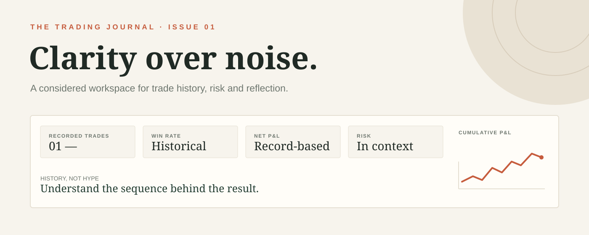
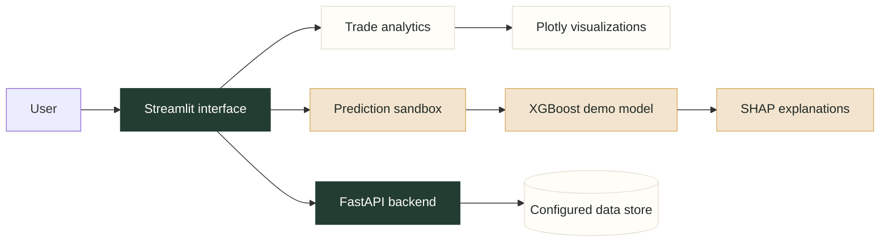

<div align="center">

# AI Trading Coach

### Clarity over noise.

A thoughtful trading analytics prototype built with **Streamlit, FastAPI, XGBoost and Plotly** — designed to explore recorded trade performance, risk metrics and explainable ML experiments.

[](https://www.python.org/)
[](https://streamlit.io/)
[](https://fastapi.tiangolo.com/)
[](https://github.com/Piyu242005/AI-Trading-Coach/actions)

[Explore the repository](https://github.com/Piyu242005/AI-Trading-Coach) · [Open the portfolio site](https://piyu242005.github.io/AI-Trading-Coach/)

</div>



> **Project status:** portfolio prototype. The dashboard analyzes available trade records; the bundled classifier uses synthetic data. It is not a live trading terminal, a validated forecasting system, or financial advice.

---

## The idea

Trading results are easier to learn from when the numbers are presented with context. AI Trading Coach brings trade-history metrics, interactive charts and a small ML experimentation workflow into one workspace.

The product direction is deliberately calm: a warm paper palette, editorial typography, clear metric hierarchy and visible explanations of what the data can—and cannot—tell you.

## What you can explore

| Workspace | What it does |
| --- | --- |
| **Performance dashboard** | Summarizes recorded trade count, historical win rate, net P&L, profit factor and drawdown. |
| **Trade ledger** | Presents the trade fields available from the current session or backend. |
| **Market & trade history** | Charts recorded entry prices and rolling averages when dates and prices exist. It does not invent missing prices. |
| **Trading insights** | Answers a small set of questions using deterministic calculations over recorded trades; this version does not call an external LLM. |
| **Prediction sandbox** | Demonstrates an XGBoost classifier trained on synthetic examples, with optional SHAP contributions. |
| **Portfolio analytics** | Breaks down trade count and P&L by asset where those fields are present. |
| **Trading journal** | Lets you record notes during a session. Entries are currently session-only, not durable storage. |

## Product principles

- **Evidence before polish.** Metrics are calculated from available records; missing fields are not replaced with made-up data.
- **Demo labels stay visible.** Sample trades and synthetic-model outputs are clearly identified.
- **Graceful empty states.** Missing prices, dates or model artifacts should be explained rather than disguised.
- **Security is explicit.** Backend sign-in requires configured password hashes and a strong JWT secret. No default credentials are shipped.
- **Prototype, not advice.** Model scores and historical results are not a recommendation to buy or sell.

## How it fits together


```mermaid
flowchart LR
    U[User] --> UI[Streamlit interface]
    UI --> A[Trade analytics]
    UI --> M[Prediction sandbox]
    UI --> API[FastAPI backend]
    A --> P[Plotly visualizations]
    M --> X[XGBoost demo model]
    X --> S[SHAP explanations]
    API --> D[(Configured data store)]
    classDef interface fill:#233d32,color:#fffdf8,stroke:#233d32
    classDef analytics fill:#fffdf8,color:#202a25,stroke:#e5dfd2
    classDef model fill:#f3e4cf,color:#202a25,stroke:#d9ad60
    class UI,API interface
    class A,P,D analytics
    class M,X,S model
```

## Technology

| Layer | Tools |
| --- | --- |
| Interface & charts | Streamlit, Plotly |
| API | FastAPI, Python |
| Data analysis | Pandas, NumPy |
| ML demonstration | XGBoost, scikit-learn, joblib |
| Explainability | SHAP, where compatible with the installed model/runtime |
| Delivery | Docker, GitHub Actions, pytest |

## Run it locally

### 1. Get the code

```bash
git clone https://github.com/Piyu242005/AI-Trading-Coach.git
cd AI-Trading-Coach
```

### 2. Install and start the Streamlit app

```bash
cd frontend-streamlit
python -m venv .venv

# macOS / Linux
source .venv/bin/activate

# Windows PowerShell
# .venv\Scripts\Activate.ps1

python -m pip install --upgrade pip
pip install -r requirements.txt

# Generate local demo model artifacts
python training/train_model.py

# Launch the UI
streamlit run app.py
```

The frontend uses `AI_TRADING_COACH_API_URL` when set; otherwise it uses the configured default API URL. To point it at a local backend, set the variable before starting Streamlit.

```bash
# macOS / Linux example
export AI_TRADING_COACH_API_URL="http://localhost:8000"
streamlit run app.py
```

### 3. Configure the backend (optional)

The API login has no built-in default credentials. Before using account features, configure:

- `JWT_SECRET`: a randomly generated secret of at least 32 characters.
- `AI_TRADING_COACH_USERS_JSON`: JSON mapping user IDs to PBKDF2 password-hash values.

Generate a secret locally:

```bash
python -c "import secrets; print(secrets.token_urlsafe(48))"
```

Generate a password hash using the repository helper:

```bash
python scripts/hash_password.py
```

Do not commit `.env` files, password hashes or production secrets. If authentication is not configured, use the guest demo.

## Model evaluation: read the fine print

The training script generates synthetic records, fits preprocessing on the training split, and reports holdout diagnostics such as accuracy, precision, recall, F1 and ROC AUC. These metrics describe the synthetic exercise only. They do **not** establish real-world predictive power or a trading edge.

Likewise, dashboard win rate and P&L are descriptive of the records loaded into the app. Drawdown is calculated from cumulative trade P&L and is not a full account-equity drawdown unless complete account data is supplied.

## Known limitations

- No live market-data provider is connected to the Streamlit interface.
- The prediction model is trained on synthetic data and is not validated for live trading.
- The insights coach uses deterministic, record-based rules rather than an external LLM.
- Journal entries live in Streamlit session state and are not persisted.
- A production release still needs a full authentication/authorization review, durable user-scoped storage, integration testing and real-data model evaluation.

## Development checks

The repository includes a GitHub Actions workflow for dependency installation, linting, Python compilation and tests. Check the [Actions tab](https://github.com/Piyu242005/AI-Trading-Coach/actions) for the latest run status.

## Roadmap

- Persist journal entries with authenticated, user-scoped storage.
- Add integration tests for API authentication, trade loading and empty/error states.
- Connect a licensed market-data provider and show source timestamps.
- Evaluate model quality only on suitable, documented real-world datasets with leakage checks and time-aware validation.
- Expand coaching only when recommendations can be grounded in observed trade context and clearly communicated uncertainty.

---

<div align="center">

**Built as a learning project in data science, ML and full-stack development.**

[Repository](https://github.com/Piyu242005/AI-Trading-Coach) · [Portfolio](https://piyu242005.github.io/AI-Trading-Coach/)

</div>
