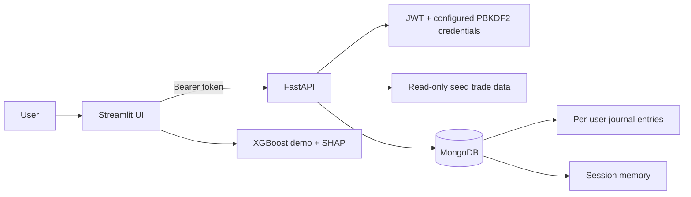

<div align="center">

# AI Trading Coach

### Read the market. Know your edge.

A portfolio-grade trading journal and analytics workspace built with **Streamlit, FastAPI, Plotly, and XGBoost** — designed to make historical trading decisions easier to review, measure, and learn from.

[](https://github.com/Piyu242005/AI-Trading-Coach/actions/workflows/ci.yml)
[](https://www.python.org/)
[](https://streamlit.io/)
[](https://fastapi.tiangolo.com/)
[](https://github.com/Piyu242005/AI-Trading-Coach)

[Explore the code](https://github.com/Piyu242005/AI-Trading-Coach/tree/master) · [Report an issue](https://github.com/Piyu242005/AI-Trading-Coach/issues)

</div>

---

> **Project status:** Portfolio prototype. Historical analytics and journal APIs are implemented; the bundled classifier uses synthetic training data. This is an educational tool, not financial advice or a production trading system.

## The idea

Trading records are most useful when they help answer practical questions: *What happened? How large were the losses? Which recorded assets contributed most to P&L? Did I document my plan?*

AI Trading Coach combines a trade-history dashboard with an authenticated journal, a small model-explainability sandbox, and a FastAPI backend. The interface follows an **Editorial FinTech** design system: warm paper surfaces, forest-green actions, ink-colored typography, and restrained amber accents.

## What you can do

| Workspace | What it does |
| --- | --- |
| **Performance dashboard** | Summarizes recorded trades, historical win rate, net P&L, profit factor, and drawdown. |
| **Trade-price analysis** | Plots recorded trade prices and descriptive rolling statistics. It does not invent missing prices or imply a live feed. |
| **Trading insights** | Answers a small set of trade-history questions from recorded data using deterministic rules. It is not an external LLM assistant. |
| **Prediction sandbox** | Runs the bundled XGBoost demo model and attempts to display SHAP feature contributions. |
| **Persistent journal** | Saves authenticated journal entries to MongoDB, scoped to the user in the verified bearer token. |
| **Portfolio analytics** | Groups recorded trade counts and P&L by asset; it does not claim a complete account valuation. |

## Design system

| Token | Value | Use |
| --- | --- | --- |
| Warm paper | `#F4F1E8` | App canvas |
| Forest green | `#174C3C` | Primary actions and key emphasis |
| Editorial ink | `#202820` | Headings and body text |
| Amber | `#E8A15A` | Small highlights |
| Serif display | Georgia / Times fallback | Editorial page titles |
| Sans-serif | System UI stack | Navigation and body text |
| Monospace | Consolas / system monospace | Financial values and technical details |

## Architecture


```mermaid
flowchart LR
    U[User] --> UI[Streamlit UI]
    UI -->|Bearer token| API[FastAPI]
    API --> AUTH[JWT + configured PBKDF2 credentials]
    API --> SEED[Read-only seed trade data]
    API --> DB[(MongoDB)]
    DB --> JOURNAL[Per-user journal entries]
    DB --> MEMORY[Session memory]
    UI --> ML[XGBoost demo + SHAP]
```

### Stack

- **Interface:** Streamlit, Plotly, custom CSS, Streamlit theme configuration
- **API:** FastAPI, Pydantic, PyJWT
- **Persistence:** MongoDB via PyMongo
- **Machine learning:** XGBoost, scikit-learn, SHAP, joblib
- **Analysis:** pandas, NumPy
- **Quality:** pytest, mongomock, Ruff, GitHub Actions, Docker Compose

## Run locally

### 1. Clone and create an environment

```bash
git clone https://github.com/Piyu242005/AI-Trading-Coach.git
cd AI-Trading-Coach
python -m venv .venv
```

Activate the environment:

```bash
# macOS / Linux
source .venv/bin/activate

# Windows PowerShell
.venv\\Scripts\\Activate.ps1
```

### 2. Install frontend dependencies and run Streamlit

```bash
pip install -r frontend-streamlit/requirements.txt
python frontend-streamlit/training/train_model.py
streamlit run frontend-streamlit/app.py
```

The guest workspace uses clearly labeled sample trades. Journal saving requires a configured backend and a signed-in user.

### 3. Configure secure backend access

Generate a password hash with the included interactive helper (the password is not printed):

```bash
python scripts/hash_password.py
```

Generate a strong JWT secret:

```bash
python -c "import secrets; print(secrets.token_urlsafe(48))"
```

Set these environment variables **outside source control**:

- `JWT_SECRET` — strong secret of at least 32 characters.
- `AI_TRADING_COACH_USERS_JSON` — JSON mapping each user ID to the helper's `salt_hex:pbkdf2_hash_hex` output.
- `MONGO_URL` — MongoDB connection string.
- `CORS_ALLOWED_ORIGINS` — comma-separated trusted browser origins (defaults to `http://localhost:8501`).
- `AI_TRADING_COACH_API_URL` — API base URL used by Streamlit; set this to the reachable API URL in hosted environments.

Then start the API and MongoDB:

```bash
docker compose up --build
```

Keep credentials, password hashes, JWT secrets, and `.env` files out of Git. The API fails closed when authentication is not configured.

## Data and model integrity

- Dashboard calculations use the trade records loaded into the app; they do not represent a complete brokerage account.
- Drawdown is calculated from cumulative trade P&L in date order when timestamps are available.
- Price analysis uses recorded trade prices only. A missing series is shown as unavailable.
- The included training pipeline creates **synthetic outcomes**. Holdout scores are useful for checking the demo workflow only; they do not estimate real-world profitability or trading accuracy.
- SHAP output is shown only when the installed model/runtime combination supports it.
- Guest journal entries are not persisted. Authenticated journal operations use the API and MongoDB.
- Never use the model output as a buy/sell instruction.

## Tests and checks

Install the development and backend/frontend dependencies, then run:

```bash
pip install -r requirements.txt
pip install -r requirements-dev.txt
pip install -r frontend-streamlit/requirements.txt
python -m compileall -q app frontend-streamlit tests
ruff check app/routes/journal.py app/models.py app/main.py frontend-streamlit/analytics.py frontend-streamlit/training/train_model.py tests/test_journal_api.py tests/test_streamlit_analytics.py
pytest
```

GitHub Actions runs lint, Python compilation, and the test suite. A green workflow verifies those automated checks, not live market-data accuracy or production readiness.

## Roadmap

- [x] Editorial color palette and typography system
- [x] Transparent trade-history metrics and honest synthetic-model labeling
- [x] Authenticated journal endpoints with per-user MongoDB persistence
- [x] Journal API tests and CI checks
- [ ] Browser-tested screenshots and responsive QA across screen sizes
- [ ] Production-grade deployment monitoring, rate limiting, and operational hardening
- [ ] Real market-data integration with source, licensing, and freshness indicators
- [ ] Train and evaluate models on appropriately licensed, real, leakage-controlled data

## Project boundary

This repository demonstrates full-stack Python development, data visualization, API integration, model training, explainability, and testing. It is **not yet a production financial application**. Production release still requires deployment-specific security review, operational monitoring, verified database configuration, and evaluation on representative real-world data.

---

<div align="center">

**Built as a learning and portfolio project.**  
Data integrity first; visual polish second.

</div>
