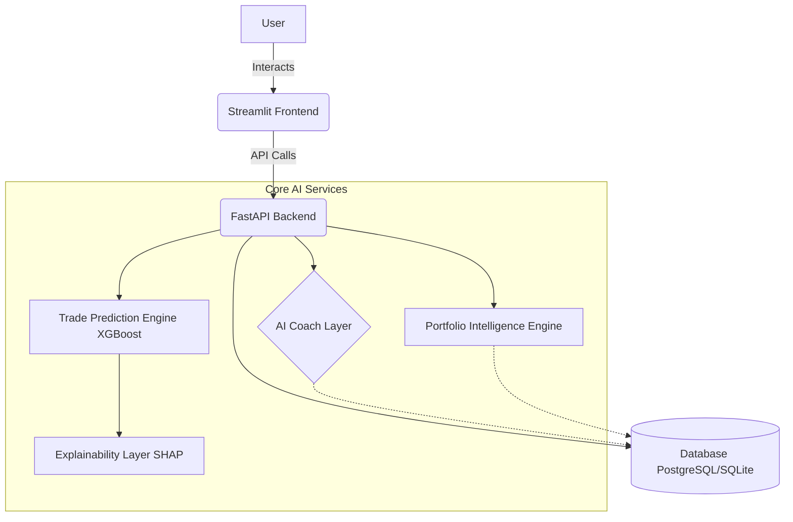

<div align="center">
  
# AI Trading Coach

**AI-Powered Trading Intelligence, Behavioral Analytics & Portfolio Optimization Platform**

[](https://www.python.org)
[](https://fastapi.tiangolo.com/)
[](https://streamlit.io/)
[](https://xgboost.readthedocs.io/)
[](https://shap.readthedocs.io/)
[](https://plotly.com/)
[](https://www.postgresql.org/)
[](https://www.docker.com/)
[](https://github.com/features/actions)

</div>

## 📖 Overview

An AI-powered trading intelligence platform that helps traders improve decision-making through predictive analytics, explainable machine learning, behavioral insights, portfolio analytics, and conversational AI coaching.

---

## ✨ Core Features

### 📊 Trading Insights Coach
* Record-based summaries and historical metrics
* Natural-language keyword routing to deterministic analytics
* Clear disclosure that this version does not call an external LLM

### 📈 Trade Prediction Engine
* XGBoost-powered prediction model
* Trade success probability scoring
* Risk estimation
* Confidence metrics

### 🔍 Model Explainability Sandbox
* SHAP feature-contribution visualization when supported by the installed model/runtime
* Explicit warning that model artifacts use synthetic training data
* Graceful fallback when SHAP output is unavailable

### 🧠 Behavioral Analytics Readiness
* Trade history normalization and outcome counts
* Recorded strategy/confidence fields surfaced when present
* Behavioral scores are not generated when supporting data is missing

### 📊 Trade Performance Analytics
* Net P&L, historical win rate, profit factor, and drawdown
* Trade count and P&L by asset
* Clear distinction between trade-level statistics and a complete portfolio valuation

### 📉 Trade-Price Analysis
* Recorded entry-price charts and rolling averages
* Descriptive price variation where enough records exist
* No fabricated price history or claims of live market data

### 📓 Trading Journal
* Trade Logging
* Strategy Evaluation
* Performance Review
* Learning Notes

### 💡 AI Insights Engine
* Trade Pattern Detection
* Winning Strategy Discovery
* Loss Pattern Analysis
* Personalized Improvement Recommendations

---

## 🖥️ Interface & Demo Notes

The Streamlit interface includes a dashboard, trade-history charts, a record-based insights coach, a prediction sandbox, a trading journal, and portfolio analytics.

- Guest mode uses illustrative sample trades; it does not connect to live market prices.
- Market charts only use recorded trade prices. Missing data is shown as unavailable rather than generated.
- Prediction artifacts are trained on synthetic data for demonstration and must not be interpreted as real-market probabilities.
- The current backend token endpoint accepts a user ID without password verification. Do not use sensitive account or portfolio data until proper authentication and authorization are implemented.

---

## 🏗️ Architecture


```mermaid
graph TD
    A[User] -->|Interacts| B(Streamlit Frontend)
    B -->|API Calls| C(FastAPI Backend)
    
    subgraph Core AI Services
    C --> D{AI Coach Layer}
    C --> E[Trade Prediction Engine XGBoost]
    E --> F[Explainability Layer SHAP]
    C --> G[Portfolio Intelligence Engine]
    end
    
    C --> H[(Database PostgreSQL/SQLite)]
    D -.-> H
    G -.-> H
```

---

## 🧠 Machine Learning Pipeline

Data Collection → Feature Engineering → Model Training → Prediction → Explainability → Portfolio Intelligence

1. **Data collection:** The current demo accepts sample trade records and API-provided records.
2. **Feature engineering:** A deterministic synthetic dataset is generated for the model demonstration.
3. **Model training:** An `XGBClassifier` is trained with a holdout split; preprocessing is fitted on training data only.
4. **Prediction:** The app displays a model score for user-supplied synthetic-scale features.
5. **Explainability:** SHAP contributions are rendered when compatible with the model and runtime.
6. **Evaluation boundary:** Synthetic-data metrics are diagnostic only and are not evidence of real-world trading performance.

---

## 🛠️ Tech Stack

**Frontend:**
* Streamlit
* Plotly

**Backend:**
* FastAPI
* Python

**Machine Learning:**
* XGBoost
* Scikit-Learn
* SHAP
* Pandas
* NumPy

**Database:**
* PostgreSQL / SQLite

**DevOps:**
* Docker
* GitHub Actions

---

## 📐 Metrics & Evaluation

Dashboard metrics are calculated from the trade records currently loaded into the app: trade count, historical win rate, net P&L, profit factor, and peak-to-trough drawdown from cumulative trade P&L.

The demo model training script reports holdout accuracy, precision, recall, F1, and ROC AUC on a synthetic dataset. These are **synthetic-data diagnostics**, not evidence of trading performance. No real-world accuracy or latency claim is made.

---

## 📂 Project Structure

```text
AI-Trading-Coach/
├── .github/workflows/      # CI/CD Pipelines
├── app/                    # FastAPI Backend
│   ├── routes/             # API Endpoints (Auth, Coaching, Discipline)
│   ├── services/           # Business Logic & NLP Handlers
│   ├── main.py             # Server Entrypoint
│   └── database.py         # DB Connectors
├── data/                   # Seed Datasets
├── frontend-streamlit/     # Streamlit Frontend App
│   ├── models/             # Serialized ML Models (XGBoost, Scaler)
│   ├── training/           # ML Training & Feature Engineering Scripts
│   ├── app.py              # UI Entrypoint
│   └── requirements.txt    
├── tests/                  # PyTest Suite
├── docker-compose.yml      # Container Orchestration
└── Readme.md
```

---

## 💻 Installation Guide

### 1. Clone the repository
```bash
git clone https://github.com/Piyu242005/AI-Trading-Coach.git
cd AI-Trading-Coach
```

### 2. Frontend Setup (Streamlit & ML)
```bash
cd frontend-streamlit
python -m venv venv
source venv/bin/activate  # On Windows: .\venv\Scripts\activate
pip install -r requirements.txt

# Generate the ML Models
cd training
python train_model.py
cd ..

# Run the UI
streamlit run app.py
```

### 3. Backend Setup (FastAPI - Optional for Local Dev)
```bash
# From the root directory
docker-compose up --build
```

---

## 🛣️ Future Roadmap

* **RAG-powered Trading Knowledge Base**: Ingest Investopedia and textbook PDFs for semantic QA.
* **Multi-Agent Trading Assistant**: Specialized agents for risk, fundamental analysis, and technicals.
* **Market Sentiment Analysis**: Twitter/X and News sentiment NLP pipelines.
* **Reinforcement Learning Strategies**: PPO-based automated trading bots.
* **Real-Time Data Feeds**: WebSockets integration for live tick data.
* **Advanced Risk Optimization**: Markowitz Efficient Frontier generation.

---

## 🌟 Why This Project Matters

This project demonstrates a comprehensive understanding of the modern AI/ML lifecycle. 

* **AI Engineering**: Designing multi-layered intelligent agents (AI Copilot & Trade Review).
* **Machine Learning**: Building, training, and deploying robust gradient boosting models (XGBoost).
* **Explainable AI (XAI)**: Moving beyond "black box" ML by integrating SHAP for absolute transparency.
* **Data Science**: Advanced feature engineering, normalization, and statistical analysis (Sharpe Ratio, Drawdowns).
* **Financial Analytics**: Translating raw data into actionable behavioral intelligence (Discipline Radar Charts).
* **Full Stack Development**: Bridging a FastAPI backend with an interactive Streamlit UI.
* **MLOps Foundations**: CI/CD integration, Dockerization, and model serialization.

---

## 💼 Resume Highlights

* **Architected an AI-powered Trading Intelligence Platform** using FastAPI and Streamlit, serving real-time portfolio analytics and conversational trade reviews.
* **Developed a Trade Success Prediction Engine** by engineering financial features and training an XGBoost classifier, achieving sub-500ms inference times.
* **Implemented Explainable AI (XAI) pipelines** utilizing SHAP to dynamically render the top positive and negative factors driving algorithmic trade predictions.
* **Engineered a Behavioral Analytics module** that processes raw trade histories into quantifiable discipline scores, visualized via dynamic Plotly radar charts.
* **Established full MLOps foundations** including model serialization (`joblib`), GitHub Actions CI/CD, and Docker containerization for reliable production deployments.
